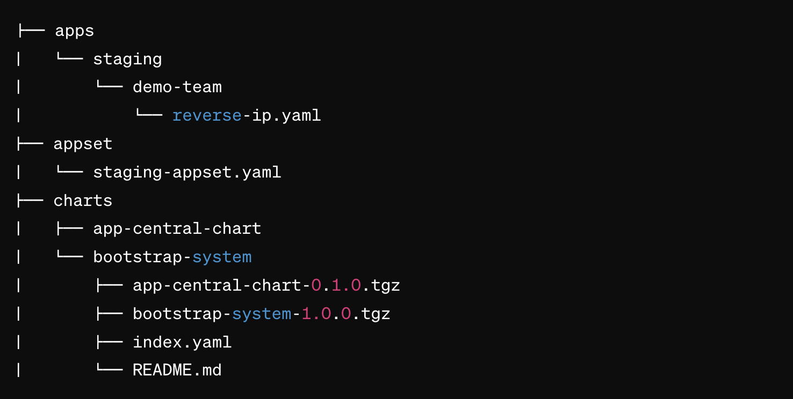

# helm-chart
# Cluster Bootstrap and Application Deployment Charts

## Overview
This repository includes two Helm charts:

- `bootstrap-system`: For initializing a Kubernetes cluster with essential components.
- `app-central-chart`: A versatile chart for deploying various applications by developers.

## Bootstrap System

The `bootstrap-system` chart includes components such as:
- `cluster-autoscaler`: For automatically adjusting the size of your cluster.
- `ingress-nginx`: For managing external access to services in your cluster.
- `kube-state-metrics`: For generating metrics about the state of Kubernetes objects.
- `metrics-server`: For aggregating resource usage data in your cluster.

Deployed using the App of Apps approach in ArgoCD, it sets up your cluster with these components out-of-the-box.

## App Central Chart

`app-central-chart` is designed for flexibility, allowing developers to deploy their services by simply customizing the values file. This prevents the need to create a new chart for each service.

## Application Values

Within the `apps` folder, developers will defind value files for applications to be deployed using `app-central-chart`. To deploy a new service, a developer needs to create a YAML file within this directory.

